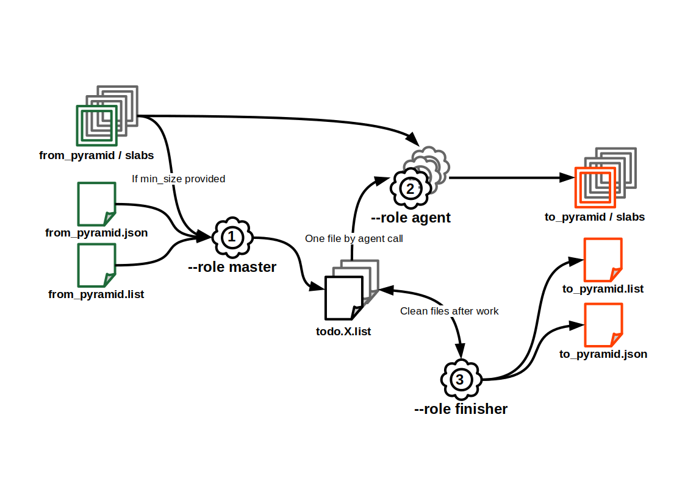
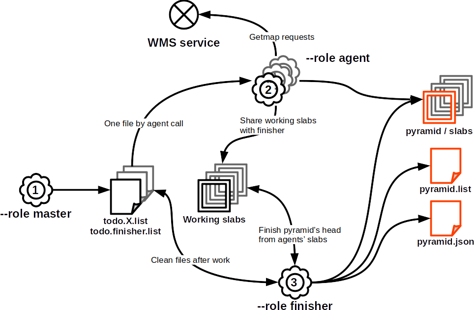

# Outils ROK4 Python


Ce projet contient des outils de gestion des pyramides de données, écrits en Python.

## Installer les outils

Installations système requises :

* debian : `apt install python3-rados python3-gdal`

Depuis [PyPI](https://pypi.org/project/rok4-tools/) : `pip install rok4-tools`

Depuis [GitHub](https://github.com/rok4/pytools/releases/) : `pip install https://github.com/rok4/pytools/releases/download/x.y.z/rok4_tools-x.y.z-py3-none-any.whl`

L'environnement d'exécution doit avoir accès aux librairies système. Dans le cas d'une utilisation au sein d'un environnement python, précisez bien à la création `python3 -m venv --system-site-packages .venv`.


## Utiliser les outils

### PYR2PYR

PYR2PYR est un outil de copie d'une pyramide d'un stockage à un autre. Il est possible de filtrer les dalles transférée en précisant une taille limite sous laquelle les données ne sont pas recopiées. La copie des dalles est parallélisable. Si des signatures MD5 sont présente dans le fichier liste, elles sont contrôlées après recopie.

Un exemple de configuration est affichable avec la commande `pyr2pyr --role example` et l'appel `pyr2pyr --role check --conf conf.json` permet de valider un fichier de configuration. Le fichier de configuration peut être un objet, auquel cas le chemin doit être préfixé par le type de stockage (exemple : `s3://bucket/configuration.json`)

#### Fonctionnement

Une copie complète d'une pyramide implique l'utilisation de l'outil avec les 3 modes suivants, dans cet ordre (tous les modes utilisent le fichier de configuration) :

1. Rôle `master`
    * Actions : génération des N TODO lists, déposé dans un dossier précisé dans la configuration (peut être un stockage objet).
    * Appel : `pyr2pyr --role master --conf conf.json`
2. Rôle `agent` :
    * Actions : lecture de la TODO list depuis le dossier de traitement et recopie des dalles
    * Appel (un appel par TODO list) : `pyr2pyr --role agent --conf conf.json --split X`
3. Rôle `finisher` :
    * Actions : lecture des TODO lists pour écrire le fichier liste final et écriture du descripteur de la pyramide en sortie.
    * Appel : `pyr2pyr --role finisher --conf conf.json`



#### Configuration

Possibilités de contenu du fichier JSON (généré à partir du schéma JSON avec `jsonschema2md src/rok4_tools/pyr2pyr_utils/schema.json /dev/stdout`)

- **`logger`** *(object)*: Logger configuration.
    - **`layout`** *(string)*: Log format, according to logging python library. Default: `%(asctime)s %(levelname)s: %(message)s`.
    - **`file`** *(string)*: Path to log file. Standard output is used if not provided.
    - **`level`** *(string)*: Log level. Must be one of: `['DEBUG', 'INFO', 'WARNING', 'ERROR', 'CRITICAL', 'NOTSET']`. Default: `WARNING`.
- **`from`** *(object)*: Pyramid to copy.
    - **`descriptor`** *(string)*: Path to pyramid's descriptor to copy.
- **`to`** *(object)*: Pyramid to write.
    - **`name`** *(string)*: Output pyramid's name.
    - **`storage`** *(object)*
        - **`type`** *(string)*: Storage type. Must be one of: `['FILE', 'S3', 'CEPH']`.
        - **`root`** *(string)*: Storage root : a directory for FILE storage, pool name for CEPH storage, bucket name for S3 storage.
        - **`depth`** *(integer)*: Tree depth, only for FILE storage. Minimum: `1`. Default: `2`.
- **`process`** *(object)*: Processing parameters.
    - **`directory`** *(string)*: Directory to write copies to process, FILE directory or S3/CEPH prefix.
    - **`parallelization`** *(integer)*: Parallelization level, number of todo lists and agents working at the same time. Minimum: `1`. Default: `1`.
    - **`follow_links`** *(boolean)*: Do we follow links (data slabs in others pyramids than the 'from' one). Default: `False`.
    - **`slab_limit`** *(integer)*: Minimum slab size (if under, we do not copy). Minimum: `0`. Default: `0`.

### JOINCACHE

L'outil JOINCACHE génèrent une pyramide raster à partir d'autres pyramide raster compatibles (même TMS, dalles de même dimensions, canaux au même format). La composition se fait verticalement (choix des pyramides sources par niveau) et horizontalement (choix des pyramides source par zone au sein d'un niveau).

Un exemple de configuration est affichable avec la commande `joincache --role example` et l'appel `joincache --role check --conf conf.json` permet de valider un fichier de configuration. Le fichier de configuration peut être un objet, auquel cas le chemin doit être préfixé par le type de stockage (exemple : `s3://bucket/configuration.json`)

#### Fonctionnement

Un calcul complet d'une pyramide implique l'utilisation de l'outil avec les 3 modes suivants, dans cet ordre (tous les modes utilisent le fichier de configuration) :

1. Rôle `master`
    * Actions : contrôle du fichier de configuration et des pyramides, identification du travail, génération des N TODO lists, déposé dans un dossier précisé dans la configuration (peut être un stockage objet).
    * Appel : `joincache --role master --conf conf.json`
2. Rôle `agent` :
    * Actions : lecture de la TODO list depuis le dossier de traitement et traitement de chaque ligne
    * Appel (un appel par TODO list) : `joincache --role agent --conf conf.json --split X`
3. Rôle `finisher` :
    * Actions : lecture des TODO lists pour écrire le fichier liste final et écriture du descripteur de la pyramide en sortie.
    * Appel : `joincache --role finisher --conf conf.json`

#### Configuration

Possibilités de contenu du fichier JSON (généré à partir du schéma JSON avec `jsonschema2md src/rok4_tools/joincache_utils/schema.json /dev/stdout`)

- **`logger`** *(object)*: Paramètres du logger. Cannot contain additional properties.
  - **`layout`** *(string)*: Log format, according to logging python library. Default: `"%(asctime)s %(levelname)s: %(message)s"`.
  - **`file`** *(string)*: Path to log file. Standard output is used if not provided.
  - **`level`** *(string)*: Log level. Must be one of: `["DEBUG", "INFO", "WARNING", "ERROR", "CRITICAL", "NOTSET"]`. Default: `"WARNING"`.
- **`datasources`** *(array)*: Source pyramids.
  - **Items** *(object)*: Cannot contain additional properties.
    - **`bottom`** *(string, required)*: Bottom level's usage for source pyramids.
    - **`top`** *(string, required)*: Top level's usage for source pyramids.
    - **`source`** *(object, required)*: Pyramids as data source. Cannot contain additional properties.
      - **`type`** *(string, required)*: Source type. Must be one of: `["PYRAMIDS"]`.
      - **`descriptors`** *(array, required)*: Paths to pyramids' descriptors (all with the same characteritics : TMS, formats...). Length must be at least 1.
        - **Items** *(string)*
- **`pyramid`** *(object)*: Output pyramid's storage informations. Cannot contain additional properties.
  - **`name`** *(string, required)*: Output pyramid's name.
  - **`root`** *(string, required)*: Storage root : a directory for FILE storage, pool name for CEPH storage, bucket name for S3 storage.
  - **`mask`** *(boolean)*: Mask export ? If true, masks are used for processing. Default: `false`.
- **`process`** *(object)*: Processing parameters. Cannot contain additional properties.
  - **`directory`** *(string, required)*: Directory to write copies to process, FILE directory or S3/CEPH prefix.
  - **`parallelization`** *(integer)*: Parallelization level, number of todo lists and agents working at the same time. Minimum: `1`. Default: `1`.
  - **`mask`** *(boolean)*: Source masks used for processing ? Default: `false`.
  - **`only_links`** *(boolean)*: Only links are made ? If true, only top slab will be considered and linked. Default: `false`.


### ASPYRO

L'outil ASPYRO génèrent une pyramide raster à de services WMS. Seuls les TMS de type quad tree sont gérés. Pour chaque source WMS, le niveau le plus bas est moissoné (requêtes WMS getmap) et les niveaux supérieurs sont calculés par sous échantillonnage 4 par 4 (command merge4tiff).

Un exemple de configuration est affichable avec la commande `joincache --role example` et l'appel `joincache --role check --conf conf.json` permet de valider un fichier de configuration. Le fichier de configuration peut être un objet, auquel cas le chemin doit être préfixé par le type de stockage (exemple : `s3://bucket/configuration.json`)

#### Fonctionnement

Un calcul complet d'une pyramide implique l'utilisation de l'outil avec les 3 modes suivants, dans cet ordre (tous les modes utilisent le fichier de configuration) :

1. Rôle `master`
    * Actions : contrôle du fichier de configuration et des sources WMS, identification du travail, génération des N TODO lists pour les agents et de celle du finisher, déposé dans un dossier précisé dans la configuration (peut être un stockage objet).
    * Appel : `aspyro --role master --conf conf.json`
2. Rôle `agent` :
    * Actions : lecture de sa TODO list depuis le dossier de traitement et traitement de chaque ligne
    * Appel (un appel par TODO list) : `aspyro --role agent --conf conf.json --split X`
3. Rôle `finisher` :
    * Actions : lecture de sa TODO list depuis le dossier de traitement et traitement de chaque ligne, puis lecture des TODO lists pour écrire le fichier liste final et écriture du descripteur de la pyramide en sortie.
    * Appel : `aspyro --role finisher --conf conf.json`



#### Configuration

Possibilités de contenu du fichier JSON (généré à partir du schéma JSON avec `jsonschema2md src/rok4_tools/aspyro_utils/schema.json /dev/stdout`)

- **`logger`** *(object)*: Logger configuration. Cannot contain additional properties.
  - **`layout`** *(string)*: Log format, according to logging python library. Default: `"%(asctime)s %(levelname)s: %(message)s"`.
  - **`file`** *(string)*: Path to log file. Standard output is used if not provided.
  - **`level`** *(string)*: Log level. Must be one of: `["DEBUG", "INFO", "WARNING", "ERROR", "CRITICAL", "NOTSET"]`. Default: `"WARNING"`.
- **`datasources`** *(array)*: Source WMS service.
  - **Items** *(object)*: Cannot contain additional properties.
    - **`bottom`** *(string, required)*: Bottom level's usage for WMS service.
    - **`top`** *(string, required)*: Top level's usage for WMS service.
    - **`source`** *(object, required)*: WMS services as data source. Cannot contain additional properties.
      - **`type`** *(string, required)*: Source type. Must be one of: `["WMS"]`.
      - **`endpoint`** *(string, required)*: URL of the WMS service.
      - **`area`**
        - **One of**
          - *object*: Bounding box to harvest.
            - **`srs`** *(string, required)*: Bounding box's coordinate system.
            - **`bbox`** *(array, required)*: Bounding box, in the provided coordinate system. Length must be equal to 4.
              - **Items** *(number)*
          - *object*: WKT geometry to harvest.
            - **`srs`** *(string, required)*: Geometry's coordinate system.
            - **`geometry`** *(string, required)*: WKT geometry, in the provided coordinate system.
          - *object*: File or object containing the geometry to harvest.
            - **`srs`** *(string, required)*: Geometry's coordinate system.
            - **`path`** *(string, required)*: File or object containing a WKT or a GeoJSON geometry, in the provided coordinate system.
      - **`format`** *(string)*: Format of requested images. Default: `"image/jpeg"`.
      - **`layers`** *(array, required)*: Layers to request with GetMap. Length must be at least 1.
        - **Items** *(string)*
      - **`styles`** *(array)*: Styles for GetMap requests. If provided, have to be the same length than the layers list. Length must be at least 1.
        - **Items** *(string)*
      - **`max_size`** *(array)*: Maximum pixel width and height of image to download. Have to be a divisor of final slab size. Length must be equal to 2. Default: `[16, 16]`.
        - **Items** *(integer)*: Minimum: `256`.
      - **`extra_params`** *(object)*: Additionnal query parameters to add to each WMS requests.
- **`pyramid`** *(object)*: Output pyramid's storage informations. Cannot contain additional properties.
  - **`name`** *(string, required)*: Output pyramid's name.
  - **`tms`** *(string, required)*: Output pyramid's TMS identifier.
  - **`slab_size`** *(array)*: Nombre de tuiles dans la dalle, dans le sens de la largeur puis de la hauteur. Length must be equal to 2. Default: `[16, 16]`.
    - **Items** *(integer)*: Minimum: `1`.
  - **`compression`** *(string)*: Output pyramid's compression. Must be one of: `["none", "jpg", "png", "jpg90", "zip", "lzw", "pkb"]`. Default: `"none"`.
  - **`storage`** *(object, required)*: Cannot contain additional properties.
    - **`type`** *(string, required)*: Storage type. Must be one of: `["FILE", "S3", "CEPH"]`.
    - **`root`** *(string, required)*: Storage root : a directory for FILE storage, pool name for CEPH storage, bucket name for S3 storage.
    - **`depth`** *(integer)*: Tree depth, only for FILE storage. Minimum: `1`. Default: `2`.
  - **`pixel`** *(object, required)*
    - **`sampleformat`** *(string, required)*: Format des canaux des images en sortie. Must be one of: `["UINT8", "FLOAT32"]`.
    - **`samplesperpixel`** *(integer, required)*: Nombre de canaux des images en sortie. Minimum: `1`. Maximum: `4`.
  - **`nodata`** *(array)*: Nodata value to fill pyramid's slab, one integer per band. Length must be at least 1.
    - **Items** *(integer)*
- **`process`** *(object)*: Processing parameters. Cannot contain additional properties.
  - **`directory`** *(string, required)*: Directory to write copies to process, FILE directory or S3/CEPH prefix.
  - **`parallelization`** *(integer)*: Parallelization level, number of todo lists and agents working at the same time. Minimum: `1`. Default: `1`.

### MAKE-LAYER

MAKE-LAYER est un outil générant un descripteur de couche compatible avec le serveur à partir des pyramides de données à utiliser

Utilisation : `make-layer [-h] [--version] --pyramids storage://path/to/pyr.json[>BOTTOM>TOP] [storage://path/to/pyr.json[>BOTTOM>TOP] ...] --name my_data [--styles normal [normal ...]] [--title my data] [--abstract my data description] [--resampling {nn,linear,bicubic,lanczos_2,lanczos_3,lanczos_4}] [--directory s3://layers_bucket]`

* `-h, --help` : affiche l'aide et quitte
* `--version` : affiche la version et quitte
* `--pyramids storage://path/to/pyr.json[>BOTTOM>TOP] [storage://path/to/pyr.json[>BOTTOM>TOP] ...]` : descripteur des pyramides à utiliser dans la couche et niveaux d'utilisation
* `--name my_data` : nom technique de la couche
* `--styles normal [normal ...]` : identifiants des styles disponibles pour la couche (pas de contrôle sur les identifiants)
* `--title my data` : titre de la couche
* `--abstract "my data description"` : résumé de la couche
* `--resampling {nn,linear,bicubic,lanczos_2,lanczos_3,lanczos_4}` : type d'interpolation pour le réechantillonnage
* `--directory s3://layers_bucket` : dossier, fichier ou objet, dans lequel écrire le descripteur de pyramide. Affiche dans la sortie standard si non fourni

### PYROLYSE

PYROLYSE est un outil d'analyse d'une pyramide, permettant d'avoir le nombre et la taille des dalles et tuiles, au global et par niveau. Les tailles des dalles et des tuiles ne sont pas toutes récupérées : un ratio permet de définir le nombre de mesures (un ratio de 100 entraînera la récupération de la taille d'une dalle sur 100 et d'une de ses tuile). Ce ratio s'applique par niveau (pour ne pas avoir que des données sur le meilleur niveau, celui qui contient le plus de dalles). Lorsque les statistiques sur les tuiles sont activées, on mesure le temps de lecture du header.

Concernant les tailles et les temps d'accès, il est possible de demander le calcul des déciles plutôt que de garder toutes les valeurs.

Utilisation : `pyrolyse [-h] [--version] --pyramid storage://path/to/pyr.json [--json storage://path/to/conf.json] [--tiles] [--progress] [--deciles] [--ratio N]`

* `-h, --help` : affiche l'aide et quitte
* `--version` : affiche la version et quitte
* `--pyramid storage://path/to/pyr.json` : descripteur de la pyramide à analyser
* `--output storage://path/to/conf.json` : fichier ou objet dans lequel écrire le résultat. Affiche dans la sortie standard si non fourni
* `--tiles` : avoir l'analyse de la taille des tuiles
* `--progress` : affiche une barre de progression, seulement avec l'option `--output`
* `--deciles` : avoir les déciles plutôt que toutes les valeurs de taille et de temps d'accès
* `--ratio N` : ratio à appliquer sur la mesure de taille (un parmi <ratio>, 100 par défaut). Toutes les dalles sont comptées

### TMSIZER

TMSIZER est un outil permettant de convertir des informations selon différents formats en accord avec un Tile Matrix Set en particulier. Les données en entrée peuvent être lues depuis un fichier, un objet ou l'entrée standard. Les données en sortie peuvent être écrites dans un fichier, un objet ou la sortie standard.

Utilisation : `tmsizer [-h] [--version] --tms <TMS identifier> [-i storage://path/to/data] -if <format> [-io <KEY>:<VALUE> [<KEY>:<VALUE> ...]] [-o storage://path/to/results] -of <format> [-oo <KEY>:<VALUE> [<KEY>:<VALUE> ...]] [--progress]`

* `-h, --help` : affiche l'aide et quitte
* `--version` : affiche la version et quitte
* `--tms <TMS identifier>` : identifiant du TMS
* `-i storage://path/to/data, --input storage://path/to/data` : fichier ou objet contenant la donnée en entrée. Lecture depuis l'entrée standard si non fourni
* `-if <format>, --input-format <format>` : format des données en entrée
* `-io <KEY>:<VALUE> [<KEY>:<VALUE> ...], --input-option <KEY>:<VALUE> [<KEY>:<VALUE> ...]` : options pour les données en entrée (dépend du format)
* `-o storage://path/to/results, --output storage://path/to/results` : fichier ou objet où écrire la donnée en sortie. Écriture dans la sortie standard si non fourni
* `-of <format>, --output-format <format>` : format des données en sortie
* `-oo <KEY>:<VALUE> [<KEY>:<VALUE> ...], --output-option <KEY>:<VALUE> [<KEY>:<VALUE> ...]` : options pour les données en sortie (dépend du format)
* `--progress` : affiche une barre de progression, seulement avec l'option `--output`

Conversions possibles (paramètres obligatoires en gras, paramètres facultatifs en italique) :

| Format en entrée | Options d'entrée | Format en sortie | Options de sortie                                             | Description                                                                                             |
|------------------|------------------|------------------|---------------------------------------------------------------|---------------------------------------------------------------------------------------------------------|
| GETTILE_PARAMS   | *`levels=<id>[,<id> ...]`*,*`layers=<id>[,<id> ...]`*     | COUNT            |                                                               | Compte le nombre de GetTile dans les URLs en entrée utilisant le TMS pivot et les éventuels niveaux et couches fournies  |
| GETTILE_PARAMS   | *`levels=<id>[,<id> ...]`*,*`layers=<id>[,<id> ...]`*     | HEATMAP          | **`bbox=<xmin>,<ymin>,<xmax>,<ymax> or area=<id>`**, **`dimensions=<width>x<height> or level=<id>`** | Génère une carte de chaleur des tuiles interrogées sur la zone demandée et sur les éventuels niveaux et couches fournies. Si un niveau est fourni en sortie, on calera la bbox et les résolutions pour avoir un pixel correpondant à l'étendue d'une tuile du niveau. Certaines aires sont prédéfinies pour certaines projections du TMS |
| GEOMETRY         |  **`format=<WKT\|GeoJSON\|WKB>`**,**`level=<id>`**                | GETTILE_PARAMS   |                   | Génére les paramètres de requête GetTile des tuiles du niveau fourni intersectant les géométries en entrée            |

Aires prédéfinies pour une carte de chaleur :

* `EPSG:3857`
  * `FXX` (France métropolitaine)

Exemple (GETTILE_PARAMS -> HEATMAP) :

`tmsizer -i logs.txt --tms PM -io levels=15,14 -io layer=LAYER.NAME1,LAYER.NAME2,LAYER.NAME3 -if GETTILE_PARAMS -of HEATMAP -oo bbox=65000,6100000,665000,6500000 -oo dimensions=600x400 -o heatmap.tif`

Exemple (GETTILE_PARAMS -> HEATMAP) avec une aire prédéfinie et une correspondance pixel-niveau:

`tmsizer -i logs.txt --tms PM -if GETTILE_PARAMS -of HEATMAP -oo area=FXX -oo level=15 -o heatmap.tif`

## Compiler la suite d'outils

```sh
apt install python3-venv python3-rados python3-gdal
python3 -m venv .venv
source .venv/bin/activate
python3 -m pip install --upgrade build bump2version
bump2version --current-version 0.0.0 --new-version x.y.z patch

# Run unit tests
python3 -m pip install -e .[test]
# To use system installed modules rados and osgeo
echo "/usr/lib/python3/dist-packages/" >.venv/lib/python3.10/site-packages/system.pth
python3 -c 'import sys; print (sys.path)'
# Run tests
coverage run -m pytest
# Get tests report and generate site
coverage report -m
coverage html -d dist/tests/

# Build documentation
python3 -m pip install -e .[doc]
pdoc3 --html --output-dir dist/ rok4_tools

# Build artefacts
python3 -m build
```

## Contribuer

* Installer les dépendances de développement :

    ```sh
    python3 -m pip install -e[dev]
    ```

* Consulter les [directives de contribution](./CONTRIBUTING.md)

## Publier la suite d'outils sur Pypi

Configurer le fichier `$HOME/.pypirc` avec les accès à votre compte PyPI.

```sh
python3 -m pip install --upgrade twine
python3 -m twine upload --repository pypi dist/rok4_tools-x.y.z-py3-none-any.whl dist/rok4_tools-x.y.z.tar.gz
```
